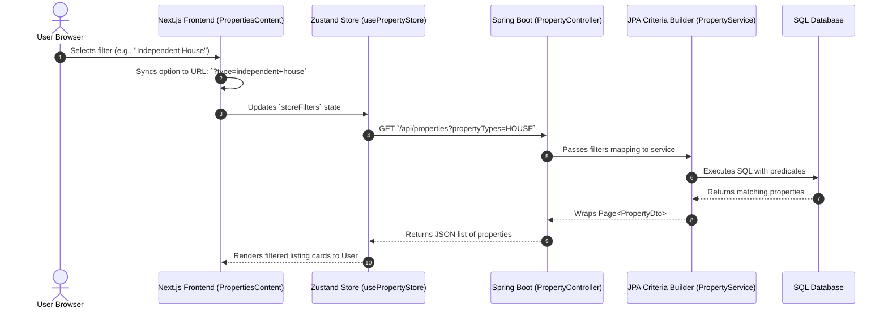

# Kanharaj Project Architecture & Workflows

Welcome to the **Kanharaj Real Estate Platform** documentation. This document explains the core technical workflows, architecture, and system design patterns implemented across the frontend and backend applications.

---

## 📂 Project Structure Overview

The repository is organized into three major components:
1. **`backend`**: Spring Boot Java application handling APIs, security, business logic, and database interactions.
2. **`frontend`**: Next.js (App Router) React application serving the main client portal.
3. **`admin-frontend`**: Next.js React portal for administrator operations (e.g., project posting, listings verification).

---

## 🔍 Workflow 1: Properties Search & Filtering

This workflow explains how property searches and filters are synchronized from the UI, through the URL, down to the database, and back.

### 1. Frontend Selection & URL Sync
- **File**: [`PropertiesContent.tsx`](file:///c:/Users/Shree%20Shyam%20Property/Downloads/kanharaj-main/kanharaj-main/frontend/src/app/properties/PropertiesContent.tsx)
- When a user interacts with top filters (Property Type, BHK, Price Range, Construction Status, etc.):
  1. Local React states (e.g. `propertyTypes`, `bhkTypes`, `budgetRange`) are updated.
  2. A `useEffect` hooks into these states, updates the URL search query parameters dynamically using Next.js `router.replace(..., { scroll: false })` (preserving the page state), and calls `setFilters(...)` to update the global Zustand state.
  3. On initial page mount, a parallel `useEffect` parses URL search parameters back into React state variables so that deep links are shareable. A case-insensitive lookup matches option formatting (e.g., lowercase `independent house` in the URL maps back to the checkbox label `Independent House`).

### 2. API Communication & Parameter Translation
- **File**: [`store.ts`](file:///c:/Users/Shree%20Shyam%20Property/Downloads/kanharaj-main/kanharaj-main/frontend/src/lib/store.ts)
- To avoid type deserialization errors in the Spring Boot backend, a translation helper `mapFrontendToBackendPropertyType` resolves user-facing options to backend database enum values:
  * `Independent House` / `Independent Floor` ➡️ `HOUSE` / `BUILDER_FLOOR`
  * `Studio` / `Duplex` / `Penthouse` ➡️ `APARTMENT`
  * `Agricultural Land` ➡️ `PLOT`
- The Zustand store hooks onto store filter updates and automatically makes an HTTP GET request to `/api/properties?params...` containing the resolved database values.

### 3. Backend Controller & Service Layers
- **Files**: [`PropertyController.java`](file:///c:/Users/Shree%20Shyam%20Property/Downloads/kanharaj-main/kanharaj-main/backend/src/main/java/com/luxeestates/controller/PropertyController.java), [`PropertyService.java`](file:///c:/Users/Shree%20Shyam%20Property/Downloads/kanharaj-main/kanharaj-main/backend/src/main/java/com/luxeestates/service/PropertyService.java)
- **Controller**: The controller receives requests via `@GetMapping` with optional parameters `@RequestParam`. It passes the list of property types as strings to prevent binding errors and forwards them to the service.
- **Service**: The service constructs a dynamic database query using JPA **Criteria API** (`Specification<Property>`). It builds predicates for:
  * `status = ACTIVE` (always enforced)
  * `search` string matching (case-insensitive `LIKE` checks across title, address, description, city, state, developer)
  * `city` and `state` equality
  * `propertyType` list containment
  * `listingType` (BUY or RENT) match
  * `bedrooms` (BHK size matching)
  * `priceMin` and `priceMax` ranges
  * `verified` and `constructionStatus` checks
- The final query is executed with page limits, automatically sorting verified and featured listings to the top.

---

## 🏗️ Workflow 2: Admin Project Flat Configurator & Carpet Area

This workflow details how administrators add flat layout designs and how the carpet area is calculated, formatted, and stored in the database.

### 1. Form Inputs and Configurator Grid
- **File**: [Project Add Wizard Page](file:///c:/Users/Shree%20Shyam%20Property/Downloads/kanharaj-main/kanharaj-main/admin-frontend/src/app/projects/add/page.tsx)
- Inside the project creation wizard, administrators specify configurations under the **Flats / Layout Configurations & Prices** section.
- Admin can add dynamic flat rows. Each row consists of a four-column inputs grid:
  1. **Configuration / BHK**: String value (e.g. `2 BHK`).
  2. **Size (Sq.Ft.)**: Overall built-up size.
  3. **Carpet Area (Sq.Ft.)**: Net usable carpet area.
  4. **Price (in ₹)**: Expected price.

### 2. Smart String Formatting & Submission
- When the form is submitted, the layout row object is compiled into a single readable string format depending on the provided inputs:
  * **Both built-up and carpet areas are provided**:
    `2 BHK (1200 sq.ft. / Carpet: 1000 sq.ft.)`
  * **Only built-up size is provided**:
    `2 BHK (1200 sq.ft.)`
  * **Only carpet area is provided**:
    `2 BHK (Carpet: 1000 sq.ft.)`
  * **Both are omitted**:
    `2 BHK`
- This compiled layout configurations array is JSON-serialized and sent to the backend database, ensuring clean formatting across all user-facing detail cards.

---

## 🛠️ Build and Compilation Verification
- **Java Backend**: Compile using `mvn compile` (or local maven script `.\apache-maven-3.9.6\bin\mvn.cmd clean compile`).
- **Next.js Frontends**: Compile using `npx tsc --noEmit` to verify type safety.
